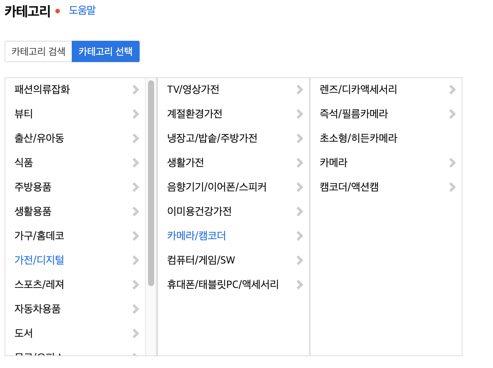

# Enum으로 계층형 상품카테고리 구현

--------

## 0. 소개

오픈마켓 프로젝트를 하면서 상품 카테고리를 구현해야 했었습니다. 
그 과정 중 문제점, 생각, 설계, 구현을 정리한 내용입니다.

## 1. 계층형 카테고리란?

</img>
      
위 그림 처럼 상위 요소 하나에 하위 요소 여러개를 포함하고 있는 트리 구조를 가진 데이터 입니다.
비즈니스 상황에서 위와 같은 구조를 가지는 다른 데이터로는 대댓글 기능을 가진 댓글을 생각해 볼 수 있습니다.
하지만 댓글은 서버 런타임 동안 유저에 의해 생성, 변경, 삭제등이 일어날 수 있는 데이터지만 
카테고리성 데이터는 일반적으로 런타임 동안 변경이 없는 정적인 데이터입니다. 

## 2. 설계

오픈마켓 프로젝트에서 상품 카테고리를 다음과 같이 설계 했습니다.

> * 카테고리 별 depth는 똑같지 않을 수 있다.
> * 상품의 추가는 마지막 카테고리(리프 카테고리)에서만 할 수 있다.
> * 상품을 카테고리로 조회 할 수 있다.
> * 카테고리 조회 시 조회 결과는 하위 카테고리 조회결과를 포함한다.


### 2.1. 상품 카테고리 데이터를 어떻게 관리할 것인가?

> #### Case1 : 관계형 데이터베이스로 관리
> 처음으로 생각한 방법은 Mysql, Oracle같은 관계형 데이터베이스에 카테고리 테이블을 생성해서
> 카테고리를 관리하는 방법을 생각했습니다. 하지만 다음과 같은 문제점이 있어서 이 방법은 선택하지 않았습니다.
> 
>> ##### 문제점 1 : 클라이언트의 요청마다 매번 데이터베이스에 접근해 카테고리를 가져와야 한다.
>> 트래픽이 많은 오픈마켓 서비스에서 상품 카테고리에 관한 요청은 매우 많습니다. 그럴때마다 데이터베이스에 접근해 
>> 카테고리 데이터를 가져와야 한다면 이는 서버의 부하로 이어지고 그로인해 서비스 품질 저하 또는 품질 유지를 위한 
>> 더 많은 비용이 발생 한다고 생각했습니다. 물론 카테고리 데이터가 서버 런타임 환경에서 생성, 변경, 삭제가 일어난다면 
>> 이 방법을 고려해 볼 수는 있으나 일반적으로 카테고리는 런타임 환경에서 변하지 않는 정적인 데이터 입니다.
>> 카테고리 데이터를 캐싱하는 방법을 쓸수 있겠으나 서비스의 구조가 복잡해지고 
>> 뒤에 선택한 방법보다 나을게 없다고 생각했습니다.
> 
>> ##### 문제점 2 : 관계형 데이터베이스 테이블이 카테고리 계층형 구조를 표현하기에 적합하지 않다.
>> 데이터베이스 테이블으로 카테고리 계층형 구조를 표현하려면 depth, 상위 카테고리의 id값 등의 메타데이터가 
>> 컬럼값으로 존재해야 된다. 이는 테이블 구조를 파악하는 것과 원하는 카테고리에 접근 하기위한 
>> 데이터베이스 SQL의 복잡도를 증가시킨다. ORM(Object Relational Mapping)기술을 사용해서 이를 
>> 어느정도 해결할 수 있겠으나 이를 완벽하게 해결할 수 없다고 생각했다. 
>> 마찬가지로 비관계형 데이터베이스를 사용하는 것보다 클래스 오브젝트로 관리하는게 좋다고 생각했다.
> 
>> ###### 문제점 3 : 그외
>> * 상품과 상품카테고리 테이블의 조인발생으로 인한 성능상 이슈
>> * 코드 레벨이 아닌 데이터베이스 레벨에서 카테고리 레코드 관리


> #### Case2 : 애플리케이션 내의 인스턴스로 관리
> 위와같은 이유로 카테고리 데이터를 애플리케이션 내의 인스턴스로 관리하는 것을 선택했다.
> 여기서 카테고리를 스프링 빈 인스턴스로 관리하는 방법과 Enum 타입 스테틱 인스턴스로 관리하는 방법 2가지가 있는데 
> 스프링 빈 인스턴스로 관리하면 카테고리 데이터를 사용하는 서비스는 스프링으로 부터 DI를 받아야한다는 불편함과 
> Enum 타입으로 관리하면 각각의 카테고리의 이름으로 바로 접근할 수 있고 카테고리 기능과 구조를 한눈에 파악할 수 있어서
> Enum 타입으로 관리하는 것을 선택했다.

### 2.2. 초기 클래스 설계

```java
import lombok.Getter;

@Getter
public enum Category {

 //... CATEGORY INSTANCE

 private final String title;
 private final Category parentCategory;
 private final List<Category> childCategories;

 Category(String title, Category parentCategory, List<Category> childCategories) {
  this.title = title;
  this.parentCategory = parentCategory;
  this.childCategories = subCategories;
 }
}
```
* title : 카테고리 이름
* parentCategory : 부모 카테고리
* childCategories : 자식 카테고리

## 3. 구현

```java
import lombok.Getter;

@Getter
public enum Category {

    ROOT(    "카테고리", null, List.of( FASHION, FOOD, DIGITAL, ...) ),
    FASHION( "패션",    ROOT, List.of( MEN_FASHION, WOMEN_FASHION, BAG_ACC, ... ) ),
    FOOD(    "음식",    ROOT, List.of( INSTANT, BEVERAGE, MEAT_EGG, ... ) ),
    
    // ...;

    private final String title;
    private final Category parentCategory;
    private final List<Category> childCategories;

    Category(String title, Category parentCategory, List<Category> childCategories) {
        this.title = title;
        this.parentCategory = parentCategory;
        this.childCategories = childCategories;
    }
}
```

### 3.1 코드 문제점 및 해결


> > #### 문제점 1 : parentCategory에 null이 들어올 수 있다.
>> ROOT의 부모 카테고리는 없습니다. ROOT의 부모카테고리 호출 시 NullPointerException 위험이 있다.
>
>> #### 해결 : Optional로 parentCategory를 감싸서 null값이 들어올 수 있다는 것을 명시한다.
> 
> ```java
> import lombok.Getter;
> import java.util.Optional;
> 
> @Getter
> public enum Category {
> 
>     ROOT(    "카테고리", null, List.of( FASHION, FOOD, DIGITAL, ...) ),
>     FASHION( "패션",    ROOT, List.of( MEN_FASHION, WOMEN_FASHION, BAG_ACC, ... ) ),
>     FOOD(    "음식",    ROOT, List.of( INSTANT, BEVERAGE, MEAT_EGG, ... ) ), 
>     // ...
>
>     private final String title;
>     private final Optional<Category> parentCategory;
>     private final List<Category> childCategories;
>
>     Category(String title, Category parentCategory, List<Category> childCategories) {
>         this.title = title;
>         this.parentCategory = Optional.ofNullable(parentCategory);
>         this.childCategories = childCategories;
>     }
> }
> ```

> > #### 문제점 2 : 상위 카테고리 인스턴스 생성 시점에 하위 카테고리 인스턴스는 존재하지 않는다.
>> JVM에서 Enum타입 인스턴스 생성은 처음 선언한 것 부터 마지막 까지 순차적으로 생성한다.
>> ROOT 인스턴스를 생성하려는 시점에는 자식 카테고리는 존재하지 않습니다. 존재하지 않는 인스턴스를 
>> 생성자로 초기화하려고 하니 컴파일 에러가 발생했습니다.
>
>> #### 해결 : 인스턴스 생성 시점에 동적으로 상위 카테고리의 리스트에 추가한다.
> ```java
> import lombok.Getter;
> import java.util.ArrayList; 
> import java.util.Optional;
> 
> @Getter
> public enum Category {
> 
>     ROOT(    "카테고리", null),
>     FASHION( "패션",    ROOT),
>     FOOD(    "음식",    ROOT),
>   
>     // ...
>
>     private final String title;
>     private final Optional<Category> parentCategory;
>     private final List<Category> childCategories;
>
>     Category(String title, Category parentCategory) {
>         this.childCategories = new ArrayList<>();
>         this.title = title;
>         this.parentCategory = Optional.ofNullable(parentCategory);
>         this.parentCategory.ifPresent(
>             parent -> parent.childCategories.add(this)
>         );       
>     }
> }
> ```

> > #### 문제점 3 : 문제점 2의 변경으로 인해 카테고리 인스턴스의 불변성이 꺠진다.
>> 카테고리 데이터는 불변객체 입니다. 그러므로 외부에서 Getter 메서드로 접근할 수 있는 
 > > childCategories 리스트도 불변객체여야 합니다.
 > > 문제점 2 변경 전에는 childCategories를 불변 리스트인 List.of()로 초기화 해서
 > > 불변성을 유지하려 했지만 변경 후 생성자로 동적으로 부모 카테고리의 리스트에 추가해야 되기 떄문에
 > > 가변리스트인 ArrayList를 사용해야 했습니다.
>
>> #### 해결 : getter로 subCategories를 반환할 떄 unmodifiableList로 감싸서 리턴한다.
> ```java
> import java.util.ArrayList; 
> import java.util.Collections; 
> import java.util.Optional;
> 
> public enum Category {
> 
>     ROOT(    "카테고리", null),
>     FASHION( "패션",    ROOT),
>     FOOD(    "음식",    ROOT), 
>     // ...
>
>     private final String title;
>     private final Optional<Category> parentCategory;
>     private final List<Category> childCategories;
>
>     Category(String title, Category parentCategory) {
>         this.childCategories = new ArrayList<>();
>         this.title = title;
>         this.parentCategory = Optional.ofNullable(parentCategory);
>         this.parentCategory.ifPresent(
>             parent -> parent.childCategories.add(this)
>         );       
>     }
> 
>     public String getTitle() { return title; }
> 
>     public Optional<Category> getParentCategory() { return parentCategory; }
> 
>     public List<Category> getChildCategories() { return Collections.unmodifiableList(childCategories); }
> }
> ```

### 3.2 요구사항 추가 구현

>> 요구사항 1 : 상품의 추가는 마지막 카테고리(리프 카테고리)에서만 할 수 있다.
>
> > 카테고리가 마지막 카테고리(리프 카테고리) 인지 반환하는 메서드를 제공해야 한다.
> ```java
> public enum Category {
> 
>     // ...
> 
>     public boolean isLeafCategory() { return childCategories.isEmpty(); }  
>
> }
> ```
> 활용 예시
> ```java
> public class registerProductService {
>     
>     // ...
>
>     public ResponseDto registerProduct(RequestDto request) {
>         Category category = request.getCategory();
>         
>         if(!category.isLeafCategory()) {
>             throw new InvalidCategoryException();
>         }
> 
>         // register product ...    
> 
>     }   
>
> } 
> ```

>> 요구사항 2 : 카테고리 조회 시 조회 결과는 하위 카테고리 조회결과를 포함한다.
> 
> > 카테고리가 포함하는 마지막 카테고리(리프 카테고리) 컬렉션을 리턴하는 메서드를 제공한다.
> ```java
> public enum Category {
>    
>    // ...
> 
>    public List<Category> getLeafCategories() {
>        return Arrays.stream(Category.values())
>                .filter(category -> category.isLeafCategoryOf(this))
>                .collect(Collectors.toUnmodifiableList());
>    }
>
>    private boolean isLeafCategoryOf(Category category) {
>        return (this.isLeafCategory() && category.contains(this))? true : false;
>    }
>
>    private boolean contains(Category category) {
>        if(this.equals(category)) return true;
>        if(category == ROOT) return false;
>
>        Category parent = category.parentCategory.get();
>
>        return this.contains(parent);
>    }
> }
> ```
> 활용 예시
> ```java
> public class searchProductService {
>     
>     // ...
>
>     public List<ResponseDto> searchProduct(RequestDto request) {
>         Category category = request.getCategory();
>         
>         return productRepository.searchProduct(category.getLeafCategories); 
> 
>     }   
>
> } 
> ```

## 4. 전체코드
```java
import java.util.*;
import java.util.stream.Collectors;

public enum Category {

    ROOT("카테고리", null),
        FASHION("패션의류/잡화", ROOT),
            FASHION_MEN("남성", FASHION),
                MEN_T_SHIRT("티셔츠", FASHION_MEN),
                MEN_SWEATSHIRT_HOOD("스웻셔츠/후드", FASHION_MEN),
                MEN_SHIRT("셔츠", FASHION_MEN),
                MEN_SUIT("정장", FASHION_MEN),
                MEN_PANTS("바지", FASHION_MEN),
            FASHION_WOMEN("여성", FASHION),
                WOMEN_T_SHIRT("티셔츠", FASHION_WOMEN),
                WOMEN_BLOUSE("블라우스/셔츠", FASHION_WOMEN),
                WOMEN_SWEATSHIRT_HOOD("스웻셔츠/후드", FASHION_WOMEN),
                WOMEN_SUIT("정장", FASHION_WOMEN),
                WOMEN_ONE_PIECE("원피스", FASHION_WOMEN),
                WOMEN_SKIRT("치마", FASHION_WOMEN),
                WOMEN_PANTS("바지", FASHION_WOMEN),
            UNISEX("남녀공용", FASHION),
                UNISEX_T_SHIRT("티셔츠", UNISEX),
                UNISEX_PANTS("바지", UNISEX),
            BAG_ACC("가방/잡화", FASHION),
                BAG("가방", BAG_ACC),
                    BACKPACK("백팩", BAG),
                    CROSS_BAG("크로스백", BAG),
                    SHOULDER_BAG("숄더백", BAG),
                    MINI_BAG("미니백", BAG),
                    ECO_BAG("캔버스/에코백", BAG),
                WALLET_BELT("지갑/벨트", BAG_ACC),
                    WALLET("지갑", WALLET_BELT),
                    BELT("벨트", WALLET_BELT),
            SHOES("신발", FASHION),
                SNEAKERS("운동화/스니커즈", SHOES),
                FLAT_SHOES("단화/플랫", SHOES),
                HEEL("힐", SHOES),
                BOOTS("워커/부츠", SHOES),
                SLIPPER("슬리퍼", SHOES),
            FASHION_CHILDREN("아동", FASHION),
                GIRL_FASHION("여아", FASHION_CHILDREN),
                BOY_FASHION("남아", FASHION_CHILDREN),
        FOOD("식품", ROOT),
            INSTANT("가공/즉석식품", FOOD),
            BEVERAGE("생수/음료", FOOD),
            FRESH("신선식품", FOOD),
            MEAT_EGG("축산/계란", FOOD),
            RICE("쌀/잡곡", FOOD),
        DIGITAL("가전/디지털", ROOT),
            VIDEO("TV/영상가전", DIGITAL),
                TV("TV", VIDEO),
                PROJECTOR("프로젝터/스크린", VIDEO),
            COMPUTER("컴퓨터/게임/SW", DIGITAL);

    private final String title;
    private final Optional<Category> parentCategory;
    private final List<Category> childCategories;

    Category(String title, Category parentCategory) {
        this.childCategories = new ArrayList<>();
        this.title = title;
        this.parentCategory = Optional.ofNullable(parentCategory);
        this.parentCategory.ifPresent(
                parent -> parent.childCategories.add(this)
        );
    }

    public String getTitle() {
        return title;
    }

    public Optional<Category> getParentCategory() {
        return parentCategory;
    }

    public List<Category> getChildCategories() {
        return Collections.unmodifiableList(ChildCategories);
    }

    public boolean isLeafCategory() {
        return childCategories.isEmpty();
    }

    public List<Category> getLeafCategories() {
        return Arrays.stream(Category.values())
                .filter(category -> category.isLeafCategoryOf(this))
                .collect(Collectors.toUnmodifiableList());
    }

    private boolean isLeafCategoryOf(Category category) {
        return (this.isLeafCategory() && category.contains(this))? true : false;
    }

    private boolean contains(Category category) {
        if(this.equals(category)) return true;
        if(category == ROOT) return false;

        Category parent = category.parentCategory.get();

        return this.contains(parent);
    }
}
```
